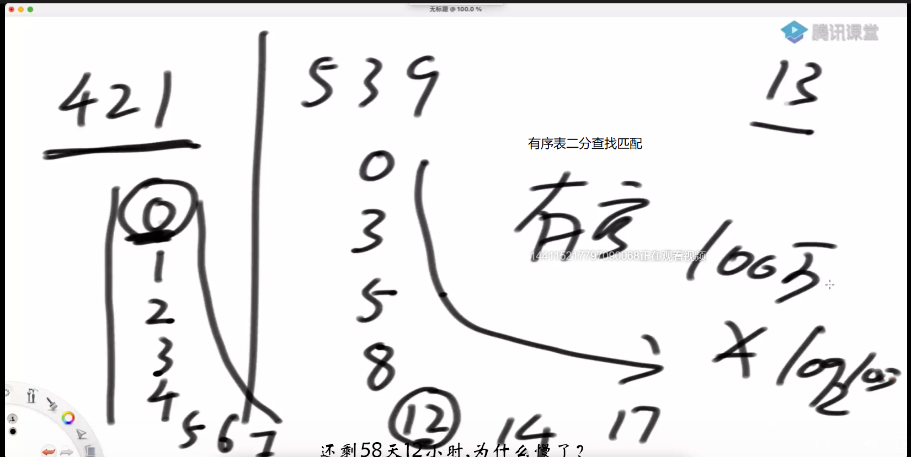

[toc]

# 一、题目

## Q1 等差数列求和

**题目描述**
给出一个正整数N和长度L，找出一段长度大于等于L的连续非负整数，他们的和恰好为N。答案可能有多个，我我们需要找出长度最小的那个。
例如 N = 18 L = 2：
5 + 6 + 7 = 18
3 + 4 + 5 + 6 = 18

都是满足要求的，但是我们输出更短的 5 6 7
**输入描述**
输入数据包括一行： 两个正整数N(1 ≤ N ≤ 1000000000),L(2 ≤ L ≤ 100)
**输出描述**
从小到大输出这段连续非负整数，以空格分隔，行末无空格。如果没有这样的序列或者找出的序列长度大于100，则输出No

## Q2 冒泡排序

## Q3 插入排序（直接）

## Q4 选择排序（直接）

## Q5 二分法

在一个有序数组中，判断一个数是否存在

## Q6 二分法

在一个有序数组中，找>= 某个数最左侧的位置

## Q7 二分法

在一个有序数组中，找<=某个数最右侧的位置

## Q8 二分法

局部最小值的问题：

在一个无序数组中，任意相邻两个数不等

局部最小数：这个数比它的左边和右边都小，这个数被称为局部最小

问题：找到任意一个（随便一个）局部最小的数，并返回index，不存在局部最小数则返回-1

## Q9 异或

【题目1】如何不用额外变量交换两个数 

【题目2】一个数组中有一种数出现了奇数次，其他数都出现了偶数次，怎么找到并打印这种数 

【题目3】怎么把一个int类型的数，提取出最右侧的1来（就像提取出钱的零头）

【题目4】一个数组中有两种数出现了奇数次，其他数都出现了偶数次，怎么找到并打印这两种数 （两个数都出现了奇数次）

【题目5】计算一个二进制有多少个1

【题目6】

一个元素类型为int的arr中，只有一种数出现了K次，其他数都出现了M次，K<M, 求出现了K次的数。

要求：额外空间复杂度O(1)，时间复杂度O(N)

## Q10动态规划

【题目1】

假设有排成一行的N个位置，记为1~N，N 一定大于或等于 2

开始时机器人在其中的M位置上(M 一定是 1~N 中的一个)

如果机器人来到1位置，那么下一步只能往右来到2位置；

如果机器人来到N位置，那么下一步只能往左来到 N-1 位置；

如果机器人来到中间位置，那么下一步可以往左走或者往右走；

规定机器人必须走 K 步，最终能来到P位置(P也是1~N中的一个)的方法有多少种

给定四个参数 N、M、K、P，返回方法数。 

## Q11动态规划

给定一个整型数组arr，代表数值不同的纸牌排成一条线

玩家A和玩家B依次拿走每张纸牌

规定玩家A先拿，玩家B后拿

但是每个玩家每次只能拿走最左或最右的纸牌

玩家A和玩家B都绝顶聪明

请返回最后获胜者的分数。 

## Q12矩阵两点最短路径（阿里笔试）

【题意描述】

给定一个n×m的矩阵，矩阵上位置为x1，y1上的小明想走到矩阵上的x2，y2位置，x、y为矩阵的行列坐标，小明可以往上、下、左、右四个方向走，但是当前位置上的数必须不大于下一个位置上的数，才能走。每走一个格子算1，小明要走到x2，y2位置，有很多条路可以走，请问路径最短的路长是多少？（坐标x从上到下，从1开始，也就是行，坐标y从左到右，从1开始，也就是列）

【输入】

第一行输入n和m，空格分隔

第二行输入x1，y1, x2, y2

后面几行输入矩阵的值

【输出】

输出最短的路长，如果没有到底目的地的路，输出-1

【例题】

输入：

5 3

1 1 5 3

4 4 3

3 5 4

6 5 6

7 4 10

8 9 9

输出：8

## Q13最长公共子序列长度

https://leetcode-cn.com/problems/longest-common-subsequence/submissions/

给定两个字符串str1和str2，

返回这两个字符串的最长公共子序列长度

比如 ： str1 = “a12b3c456d”,str2 = “1ef23ghi4j56k”

最长公共子序列是“123456”，所以返回长度6

## Q14背包问题（动态规划）

给定两个长度都为N的数组weights和values，

weights[i]和values[i]分别代表 i号物品的重量和价值。

给定一个正数bag，表示一个载重bag的袋子，

你装的物品不能超过这个重量。

返回你能装下最多的价值是多少? 

## Q15字符串转换

规定1和A对应、2和B对应、3和C对应...26和Z对应

那么一个数字字符串比如"111”就可以转化为:

"AAA"、"KA"和"AK"

给定一个只有数字字符组成的字符串str，返回有多少种转化结果 

## Q16贴纸拼词

https://leetcode-cn.com/problems/stickers-to-spell-word/submissions/

给定一个字符串str，给定一个字符串类型的数组arr，出现的字符都是小写英文

arr每一个字符串，代表一张贴纸，你可以把单个字符剪开使用，目的是拼出str来

返回需要至少多少张贴纸可以完成这个任务。

例子：str= "babac"，arr = {"ba","c","abcd"}

ba + ba + c 3

 abcd + abcd 2

 abcd+ba 2

所以返回2

## Q17最长无重复字符子串长度

## Q18 不相邻最大子序列累加和（待完成）

返回一个数组中，选择的数字不能相邻的情况下，

最大子序列累加和

## Q19字符串种类

只由小写字母（a~z）组成的一批字符串

都放在字符类型的数组String[] arr中

如果其中某两个字符串所含有的字符种类完全一样

就将两个字符串算作一类

比如：baacbba和bac就算作一类

返回arr中有多少类？

## Q20矩阵面积

给定一个只有0和1组成的二维数组

返回边框全是1的最大正方形面积

https://leetcode.com/problems/largest-1-bordered-square/

## Q21 凑对比赛

给定一个数组arr，代表每个人的能力值。再给定一个非负数k

如果两个人能力差值正好为k，那么可以凑在一起比赛

一局比赛只有两个人

返回最多可以同时有多少场比赛

## Q22 

给定三个参数：

二叉树的头节点head，树上某个节点target，正数K

从target开始，可以向上走或者向下走

返回与target的距离是K的所有节点

## Q23

给定一个正数数组arr，代表若干人的体重

再给定一个正数limit，表示代表每艘船的载重量

每艘船最多坐两人，且不能超过载重

想让所有的人同时过河，并且用最好的分配方法让船尽量少

返回最少的船数

## Q24 Leetcode 最接近sum的子序列累加和问题

https://leetcode.com/problems/closest-subsequence-sum/

给你一个整数数组 nums 和一个目标值 goal 。

你需要从 nums 中选出一个子序列，使子序列元素总和最接近 goal 。也就是说，如果子序列元素和为 sum ，你需要 最小化绝对差 abs(sum - goal) 。

返回 abs(sum - goal) 可能的 最小值 。

注意，数组的子序列是通过移除原始数组中的某些元素（可能全部或无）而形成的数组。

 

示例 1：

输入：nums = [5,-7,3,5], goal = 6
输出：0
解释：选择整个数组作为选出的子序列，元素和为 6 。
子序列和与目标值相等，所以绝对差为 0 。
示例 2：

输入：nums = [7,-9,15,-2], goal = -5
输出：1
解释：选出子序列 [7,-9,-2] ，元素和为 -4 。
绝对差为 abs(-4 - (-5)) = abs(1) = 1 ，是可能的最小值。
示例 3：

输入：nums = [1,2,3], goal = -7
输出：7


提示：

1 <= nums.length <= 40
-107 <= nums[i] <= 107
-109 <= goal <= 109

# 二、笔记

## Q1

## Q2冒泡排序

### 1基本思想

每趟不断将记录两两比较，并按“前小后大” 规则交换

1. 第一趟


1. 第二趟

   第一趟时，最大的数（气泡）被排到了最后（冒到了水的顶部），也就是说，最后胡一个数已经拍好。因此第二趟不需要管最后一个数。

2. 第n趟

   不需要管N-（n-1）个数

3. 每一趟本质都是找出当前趟中最大的数，并放到最后

### 2实现步骤

```java
for(int i=arr.length-1; i > 0; i--) //i是当前趟需要比较的次数
    for(int j=0; j<i; j++) //j是需要比较的两个数的左边的数
        if (arr[j]>arr[j+1]){
                    swap(arr, j, j+1);
                }
```

### 3时间复杂度

第1趟比较次数	n-1	次

第2趟比较次数	n-2	次

第3趟比较次数	n-3	次

第4趟比较次数	n-4	次

第5趟比较次数	n-5	次

……

第N-1趟比较次数	1	次

时间复杂度：$1+2+3+...+(n-1)=\frac{(1+n-1)}{2}=\frac{n^2}{2}, O(n^2)$

## Q3插入排序（直接）

### 为什么叫插入排序？

先将第一个数排好序（已经排好）

再将第二个数排好序，此时，只需要和第二个数比较

再将第三个数排好序，此时，前面的数已经排好序了，只需要确定第三个数要插在那里，这就是叫插入排序的原因。

### 如何“插入”？

因为前面的数已经排好，所以，可以先和脸前第1个数比较大小

如果比脸前第1个数大，那么就可以确定比前面所有的数大，插入的位置就是当前位置（不需要移动）

如果比脸前第1个数小，那么交换，还需要和当前脸前第1个数比较

……

### 时间复杂度

最坏情况下，序列是从大到小排序，此时，

第1趟需要 1次比较

第2趟需要 2次比较

……

第n-1趟需要 n-1 次比较

时间复杂度：$1+2+3+...+(n-1)=\frac{(1+n-1)}{2}=\frac{n^2}{2}, O(n^2)$

**注意：冒泡和插入排序的时间复杂度都是$O(n^2)$，但是插入排序更优秀，因为如果比前面第1个数大，就不需要移动**

## Q4选择排序（直接）

从1到n中选最小的数，放到第1位（通过和第1位交换），此时，第1位有序

从2到n中选最小的数，放到第2位（通过和第2位交换），此时，第1~2有序

从3到n中选最小的数，放到第3位（通过和第3位交换），此时，第1~3有序

从4到n中选最小的数，放到第4位（通过和第4位交换），此时，第1~4有序

从5到n中选最小的数，放到第5位（通过和第5位交换），此时，第1~5有序

……

从n-1到n中选最小的数，放到第n-1位（通过和第n-1位交换），此时，第1~n有序

###  时间复杂度

从1到n中选最小的数，需要n-1次比较

从2到n中选最小的数，需要n-2次比较

从3到n中选最小的数，需要n-3次比较

从4到n中选最小的数，需要n-4次比较

从5到n中选最小的数，需要n-5次比较

……

从n-1到n中选最小的数，需要1次比较

时间复杂度：$1+2+3+...+(n-1)=\frac{(1+n-1)}{2}=\frac{n^2}{2}, O(n^2)$

## Q6


## Q7


## Q8


## Q9

【认识异或】
相同为0，不同为1，重点在异
记为无进位相加
【性质】
0^N == N      N^N == 0
异或运算满足交换律和结合率

【题目1】
如何不用额外变量交换两个数 

```java
//两个变量的内存地址不能相同，相同时，给一个变量赋值会改变另一个变量的值
//将两个变量异或三次，交替赋值给两个变量
a = a^b;
b = a^b; //==a^b^b==a
a = a^b;
```

【题目2】
一个数组中有一种数出现了奇数次，其他数都出现了偶数次，怎么找到并打印这种数 

```java
//用整型变量与数组的每一个数进行异或
//异或后，因为交换律、结合律，偶数次的数会被N^N消掉
```

【题目三】
怎么把一个int类型的数，提取出最右侧的1来（提取出钱的零头）

```java
//取这个数的2的补码后与本身想与，最好是取反加一，防止负数
//如果直接取反想与会得0，取反加一后会使这个数以最右侧的1为界，高位与原高位相反，低位相同
(~a+1)&a
-a&a
```

【题目四】
一个数组中有两种数出现了奇数次，其他数都出现了偶数次，怎么找到并打印这两种数 （两个数都出现了奇数次）

**实际上是利用异或的特性，将a和b分开**

1. 声明变量eor，假设那两个数是a、b，可知a！=b
2. 用eor异或数组一遍，因为异或的性质：出现偶数次的数会抵消。此时eor=a^b
3. 找到二进制的eor上的一个1（不妨设为最右侧的1），设这个1的位置是i
4. 那么，a和b的二进制中，i位上的数必然不同。一个是0，一个是1。假如相同，那么eor=a^b的二进制必然是0，因为异或相同得0，不同得1
5. 通过这个i位将数组中的数分成两类，一类是i位上为1的数，一类是i位上为0的数，可知ab在不同的类中，假设a在A类，b在B类
6. 令eor1和A类中的每一个数异或，eor1 = a, 得a
7. 再和eor异或，eor1 = eor1^eor = a ^ (a&b) = b，得b

【题目五】
计算一个二进制有多少个1

```
//数最右侧有多少个1，数1个，删一个
while(num != 0){
	rightOne = num & (-num); //提取最右侧的1
	count++;  //计算有多少个1
	num = num ^ rightOne; //将最右侧的1抹为0，相同为0
}
```

【题目六】
一个元素类型为int的arr中，只有一种数出现了K次，其他数都出现了M次，K<M, 求出现了K次的数。要求：额外空间复杂度O(1)，时间复杂度O(N)

如果不要求空间复杂度：构建HashMap

1. 设出现了K次的数为luckOne
2. 遍历一遍数组，记录每一位上出现1的次数：声明一个32个元素的数组（32位：因为int型是32位，用32个元素可以记录每一位出现1的记录）
3. ​     i位上的总次数模上M 
   1. != 0， 说明luckOne在这位上是1，
   2. ==0,  说明luckOne在这位上是0, 
   3. 因为如果是1，总次数不会是M的整数倍
4. 遍历这个32位的数组，那么便可以得到luckOne从0到31位上是0还是1
5. 组装出luckOne

## Q10

【题目1】

假设有排成一行的N个位置，记为1~N，N 一定大于或等于 2

开始时机器人在其中的M位置上(M 一定是 1~N 中的一个)

如果机器人来到1位置，那么下一步只能往右来到2位置；

如果机器人来到N位置，那么下一步只能往左来到 N-1 位置；

如果机器人来到中间位置，那么下一步可以往左走或者往右走；

规定机器人必须走 K 步，最终能来到P位置(P也是1~N中的一个)的方法有多少种

给定四个参数 N、M、K、P，返回方法数。 

***

1. 第一步：模拟法：
   1. 从模拟的角度出发，可以很容易发现这是一个递归题。
   2. 要知道机器人从M位置走K步到P位置，只需要知道
      1. 机器人从M-1位置走K-1步到P位置 的方法数
      2. 机器人从M+1位置走K-1步到P位置 的方法数
   3. 找basicCase：机器人只剩0步可以走，那么
      1. 如果当前机器人位置==P位置，成功，方法数是1
      2. 如果当前机器人位置！=P位置，失败，方法数是0
2. 第二步：傻缓存法


3. 第三步：动态规划自己填表


## Q11动态规划

给定一个整型数组arr，代表数值不同的纸牌排成一条线

玩家A和玩家B依次拿走每张纸牌

规定玩家A先拿，玩家B后拿

但是每个玩家每次只能拿走最左或最右的纸牌

玩家A和玩家B都绝顶聪明

请返回最后获胜者的分数。 

***

1. 第一步：模拟

   1.  baseCase：只剩一张牌了

   2. 否则，只有两种选择，要么要最左，要么拿最右。也就是

      1. 拿左好
      2. 还是拿右好

   3. 先手拿到的最好分数

      1. 拿左边：左边当前牌的分数 + 拿走牌后，自己作为后手能拿到的最好分数（当你拿走一张牌之后，是对方先拿，你后拿）
      2. 拿右边：右边当前牌的分数 + 拿走牌后，自己作为后手能拿到的最好分数（当你拿走一张牌之后，是对方先拿，你后拿）

      以上两个中的最大值，因为先手是自己能选，你是老大

   4. 后手能拿到的最好分数：

      1. 抽走左边后，自己先手能拿到的最好分数
      2. 抽走右边后，自己先手能拿到的最好分数

      以上两个中的最小值，因为抽哪张牌不是你决定的，全部牌的分数是一定的，你分数高了，对手分数就少了，所以对手会抽走对他有利、对你不利的牌，你能拿到的，只有最小值

      1. 设自己作为先手能拿到的最好分数为f(x), 后手能拿到的最好分数是g(x), 那么先手选手能获得的最好分数：

      $$
      f(x) = max(左+g(抽走左边后), 右+g(抽走右边后))
      
      \\g(x) = min(f(抽走左边后), f(抽走右边后))
      $$

2. 傻缓存法、动态规划自己填


## Q12矩阵两点最短路径（阿里笔试）

【题意描述】

给定一个n×m的矩阵，矩阵上位置为x1，y1上的小明想走到矩阵上的x2，y2位置，x、y为矩阵的行列坐标，小明可以往上、下、左、右四个方向走，但是当前位置上的数必须不大于下一个位置上的数，才能走。每走一个格子算1，小明要走到x2，y2位置，有很多条路可以走，请问路径最短的路长是多少？（坐标x从上到下，从1开始，也就是行，坐标y从左到右，从1开始，也就是列）

【输入】

第一行输入n和m，空格分隔

第二行输入x1，y1, x2, y2

后面几行输入矩阵的值

【输出】

输出最短的路长，如果没有到底目的地的路，输出-1

【例题】

输入：

5 3

1 1 5 3

4 4 3

3 5 4

6 5 6

7 4 10

8 9 9

输出：8

***

* 采用递归，可以知道，想要到x2，y2，只需要知道min(从当前位置的上下左右位置到x2，y2位置的路长）
* baseCase：当前位置==x2，y2
* 边界：当到达矩阵的边界时，小明不能往边界外移动
* 防止走回来绕圈圈：用old矩阵记录每个位置来没来过

## Q13最长公共子序列长度

给定两个字符串str1和str2，

返回这两个字符串的最长公共子序列长度

比如 ： str1 = “a12b3c456d”,str2 = “1ef23ghi4j56k”

最长公共子序列是“123456”，所以返回长度6

***

1. 假设str1中要考虑的范围是0~i（也就是忽略i后面的字符），str2中要考虑的范围是0~j，要知道最长公共子序列长度，只需要知道
   1. 前i-1的str1与前j-1的str2的最大公共子序列长度 + （str[i] == str[j] ? 1 :0) 
   2. 可以以i结尾、不以j结尾的最大公共子序列长度（因为在0~i范围上的最长公共子序列如果不以N结尾，那么这个序列一定在0~i-1范围上，和1重复）
   3. 可以以j结尾、不以i结尾的最大公共子序列长度（因为在0~j范围上的最长公共子序列如果不以N结尾，那么这个序列一定在0~j-1范围上，和1重复）
   4. 以上结果的max
2. 可以以i结尾、不以j结尾的最大公共子序列长度
   1. 因为不以j结尾，所以不需要考虑j
   2. 长度=考虑i，j-1的最大公共子序列长度
3. 可以以j结尾、不以i结尾的最大公共子序列长度
   1. 因为不以i结尾，所以不需要考虑i
   2. 长度=考虑i-1，j的最大公共子序列长度
4. basicCase: 
   1. i和j都为1，这时候只需要比较str1[0]和str2[0]

## Q14背包问题（动态规划）

给定两个长度都为N的数组weights和values，

weights[i]和values[i]分别代表 i号物品的重量和价值，其中的值都不为负数

给定一个正数bag，表示一个载重bag的袋子，

你装的物品不能超过这个重量。

返回你能装下最多的价值是多少? 

***

1. 对于第i个物品，我们都有两种选择，要或是不要。我们只需要知道要的最大价值p1，和不要的最大价值p2，取max(p1, p2)即可。
2. 要知道从0~N能装下的最多价值，只需要知道
   1. ①如果我们还能背得动，背第N个物品的情况下，p1 =
      1.   value[N-1]  +
      2. （在背包容量减少w[N-1]的情况下）0~N-1上能装下的最多价值
   2. ②放弃第N个物品的情况下，p1 = 0~N-1上能装下的最多价值
3. 再取①②中的最大值即可
4. basicBase
   1. 背包没容量了，拿不了物品（**注意：背包不足以拿当前的物品时还没有结束，还可以拿前面的物品**）
   2. 物品没了，拿不了物品

## Q15

规定1和A对应、2和B对应、3和C对应...26和Z对应

那么一个数字字符串比如"111”就可以转化为:

"AAA"、"KA"和"AK"

给定一个只有数字字符组成的字符串str，返回有多少种转化结果 

***

* 除0外的任意的1位数都可以转换成字符
* 任意的3位数不能转换成字符
* 大于26的2位数不能转换成字符
* 面对字符串数组中的每一个
  * 要么把它当做一位数
  * 要么把它当做二位数
* 思考从0~N-1的字符串加上第N位后，会发生的事情

0~N上的字符串的转换结果总数，等于

*  这一位可以当做1位数？ 0~N-1上转换结果总数 : 0 
  +
* 0~N-2上转换结果总数 + 这一位和N-1位可以当做2位数？1:0

【basicCase】

index<0

【这一位和N-1位可以当做2位数】

* 必须得有N-1位
* N-1位必须不是0
* 表示的数必须<=26

## Q16贴纸拼词

给定一个字符串str，给定一个字符串类型的数组arr，出现的字符都是小写英文

arr每一个字符串，代表一张贴纸，你可以把单个字符剪开使用，目的是拼出str来

返回需要至少多少张贴纸可以完成这个任务。

例子：str= "babac"，arr = {"ba","c","abcd"}

ba + ba + c 3

 abcd + abcd 2 

abcd+ba 2

所以返回2

***

【实现给定一个贴纸和目标字符串的字符统计，返回剩余的字符串字符统计】

计算每个小写字母上 gap=贴纸词频和目标词频的差距，

* 如果>=0，说明剪完掉了
* 如果<0, 说明没剪掉、没剪完，剩余 -gap 个

最后用StringBuilder构建剩下的字符

【生成字符统计（因为字符串的顺序无意义）】

【主递归函数】

对目标字符串字符统计上的第一个字符，找到所有能剪个字符的贴纸（也就是该位置上不为0），每个剪一次，形成分支

最小张树：min(每个分支的最小张数)

每个分支的最小张数：1 + 处理后的字符串最小需要贴纸张数

## Q17求一个字符串中，最长无重复字符子串长度

假设字符串str长度为N

要知道str[0......N-1]上的最长无重复字符字串长度，

只需要知道 

str[0......N-2]上的最长无重复字符字串长度

和 以str[N-1]作为结尾的无重复字符字串长度

basicCase：

str[N-1] 不存在，返回0

N-1 == 0, 返回1

***

【对数器】

可以发现，递归函数rec的参数变化只有i

i位置的rec返回值依赖 i-1

【动态规划】


## Q18 不相邻最大子序列累加和

返回一个数组中，选择的数字不能相邻的情况下，

最大子序列累加和

***

## Q19字符串

只由小写字母（a~z）组成的一批字符串

都放在字符类型的数组String[] arr中

如果其中某两个字符串所含有的字符种类完全一样

就将两个字符串算作一类

比如：baacbba和bac就算作一类

返回arr中有多少类？

***

【对数器方法】

1. 将字符串转换成长度为26的boolean数组
2. 写个boolean数组的比较器，认为值一样就相同
3. 把全部boolean数组放到HashSet里面，返回HashSet的大小

【优化方法】

1. 一个小写字符且没有重复的字符串，可以使用int型唯一的确定
2. 转换成int，放进HashSet
3. 返回HashSet大小

## Q20矩阵面积

给定一个只有0和1组成的二维数组

返回边框全是1的最大正方形面积

https://leetcode.com/problems/largest-1-bordered-square/

***

1. 循环一遍二维数组铁定的
2. 到一个点的时候，边长循环走到长宽的尽头，铁定的
3. 检验每个点是不是1，如果真的遍历，又O(N)，这里可以优化
   1. 如果知道每个点右边有几个连续的1（包括自己）
   2. 又知道每个点下边又几个连续的1（包括自己）
   3. 那么就可以通过判断左上点、左下点、右上点来确定这个矩形符不符合规范

【预处理工作：生成每个点右边、下边有几个连续的1】

用int数组，右边：从最右开始，本身是0数组得0，不是的话，右边的值加一

## Q21 凑对比赛

给定一个数组arr，代表每个人的能力值。再给定一个非负数k

如果两个人能力差值正好为k，那么可以凑在一起比赛

一局比赛只有两个人

返回最多可以同时有多少场比赛

***

【暴力解】

搞出全排列，最后假设1和2比，2和3比，……

体系版18节

***

经典窗口：【L，R】

L<R窗口正常

L=R窗口只有一个值

L>R窗口没了

1. 先排序
2. 用窗口
3. 用boolean数组表示这个值用没用过
4. 能力差值比K小，R动
5. 能力差值比K大，L动
6. 用变量ans记录配对成功的次数

## Q22 

给定三个参数：

二叉树的头节点head，树上某个节点target，正数K

从target开始，可以向上走或者向下走

返回与target的距离是K的所有节点

***

1. 生成父map，使任何节点能访问到父节点。

2. 用队列存储同距离的节点
3. 用hashSet存储访问过的节点，通过判断set存不存在该节点来判断节点有没有访问过
4. 用ArrayList存储需要返回的节点

## Q23

给定一个正数数组arr，代表若干人的体重

再给定一个正数limit，表示代表每艘船的载重量

每艘船最多坐两人，且不能超过载重

想让所有的人同时过河，并且用最好的分配方法让船尽量少

返回最少的船数

***

1. 先遍历一遍，看有没有单个胖子超过载重的，有，直接返回

2. 数组排序
3. 


## Q24 Leetcode 最接近sum的子序列累加和问题

https://leetcode.com/problems/closest-subsequence-sum/

给你一个整数数组 nums 和一个目标值 goal 。

你需要从 nums 中选出一个子序列，使子序列元素总和最接近 goal 。也就是说，如果子序列元素和为 sum ，你需要 最小化绝对差 abs(sum - goal) 。

返回 abs(sum - goal) 可能的 最小值 。

注意，数组的子序列是通过移除原始数组中的某些元素（可能全部或无）而形成的数组。

 

示例 1：

输入：nums = [5,-7,3,5], goal = 6
输出：0
解释：选择整个数组作为选出的子序列，元素和为 6 。
子序列和与目标值相等，所以绝对差为 0 。
示例 2：

输入：nums = [7,-9,15,-2], goal = -5
输出：1
解释：选出子序列 [7,-9,-2] ，元素和为 -4 。
绝对差为 abs(-4 - (-5)) = abs(1) = 1 ，是可能的最小值。
示例 3：

输入：nums = [1,2,3], goal = -7
输出：7


提示：

1 <= nums.length <= 40
-107 <= nums[i] <= 107
-109 <= goal <= 109

***

分治的视频：38节、39节

数组小，所以使用分治




# 三、语录

* 左程云『既然语言都有这些结构和api，为什么还需要手撸练习？』
  * 1）算法问题无关语言
  * 2）语言提供的api是有限的，当有新的功能是api不提供的，就需要改写
  * 3）任何软件工具的底层都是最基本的算法和数据结构，这是绕不过去的
  * 要考试

# 暂时没心情写的题

## class3

1)单链表和双链表如何反转

2)把给定值都删除

3)双向链表实现队列和栈

4) 数组实现队列和栈：begin和end的相互追赶？垃圾感觉，用size规定能不能

* 实现一个特殊的栈，在基本功能的基础上，再实现返回栈中最小元素的功能  

  * 1）pop、push、getMin操作的时间复杂度都是 O(1)。 
  * 2）设计的栈类型可以使用现成的栈结构。

* 1）如何用栈结构实现队列结构

  2）如何用队列结构实现栈结构

* 归并排序应用题的本质：排序成有序信息。而这有序信息会帮我省掉很多事

## class4

* 归并排序
* 数组小合：每一个数有多少左边比它小的数相加
* 有多少个逆序对（逆序对：右边比自己小的数和自己组成逆序对）
* 每个数右边有多少个*2都不比该数大的个数
* 

动态规划体系18到20节


4. 