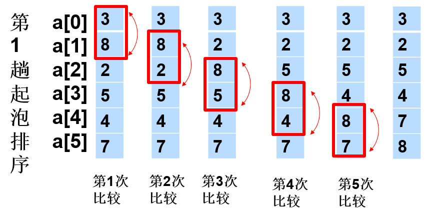

[toc]

# 1.什么是排序？

 将一组杂乱无章的数据按一定规律顺次排列起来。

# 2. 排序算法

## 1冒泡排序

### 1基本思想

每趟不断将记录两两比较，并按“前小后大” 规则交换

1. 第一趟



1. 第二趟

   第一趟时，最大的数（气泡）被排到了最后（冒到了水的顶部），也就是说，最后胡一个数已经拍好。因此第二趟不需要管最后一个数。

2. 第n趟

   不需要管N-（n-1）个数

3. 每一趟本质都是找出当前趟中最大的数，并放到最后

### 2实现步骤

```java
for(int i=arr.length-1; i > 0; i--) //i是当前趟需要比较的次数
    for(int j=0; j<i; j++) //j是需要比较的两个数的左边的数
        if (arr[j]>arr[j+1]){
                    swap(arr, j, j+1);
                }
```

### 3时间复杂度

第1趟比较次数	n-1	次

第2趟比较次数	n-2	次

第3趟比较次数	n-3	次

第4趟比较次数	n-4	次

第5趟比较次数	n-5	次

……

第N-1趟比较次数	1	次

时间复杂度：$1+2+3+...+(n-1)=\frac{(1+n-1)}{2}=\frac{n^2}{2}, O(n^2)$

## 2插入排序（直接）

### 为什么叫插入排序？

先将第一个数排好序（已经排好）

再将第二个数排好序，此时，只需要和第二个数比较

再将第三个数排好序，此时，前面的数已经排好序了，只需要确定第三个数要插在那里，这就是叫插入排序的原因。

### 如何“插入”？

因为前面的数已经排好，所以，可以先和脸前第1个数比较大小

如果比脸前第1个数大，那么就可以确定比前面所有的数大，插入的位置就是当前位置（不需要移动）

如果比脸前第1个数小，那么交换，还需要和当前脸前第1个数比较

……

### 时间复杂度

最坏情况下，序列是从大到小排序，此时，

第1趟需要 1次比较

第2趟需要 2次比较

……

第n-1趟需要 n-1 次比较

时间复杂度：$1+2+3+...+(n-1)=\frac{(1+n-1)}{2}=\frac{n^2}{2}, O(n^2)$

**注意：冒泡和插入排序的时间复杂度都是$O(n^2)$，但是插入排序更优秀，因为如果比前面第1个数大，就不需要移动**

## 3选择排序（直接）

从1到n中选最小的数，放到第1位（通过和第1位交换），此时，第1位有序

从2到n中选最小的数，放到第2位（通过和第2位交换），此时，第1~2有序

从3到n中选最小的数，放到第3位（通过和第3位交换），此时，第1~3有序

从4到n中选最小的数，放到第4位（通过和第4位交换），此时，第1~4有序

从5到n中选最小的数，放到第5位（通过和第5位交换），此时，第1~5有序

……

从n-1到n中选最小的数，放到第n-1位（通过和第n-1位交换），此时，第1~n有序

###  时间复杂度

从1到n中选最小的数，需要n-1次比较

从2到n中选最小的数，需要n-2次比较

从3到n中选最小的数，需要n-3次比较

从4到n中选最小的数，需要n-4次比较

从5到n中选最小的数，需要n-5次比较

……

从n-1到n中选最小的数，需要1次比较

时间复杂度：$1+2+3+...+(n-1)=\frac{(1+n-1)}{2}=\frac{n^2}{2}, O(n^2)$

