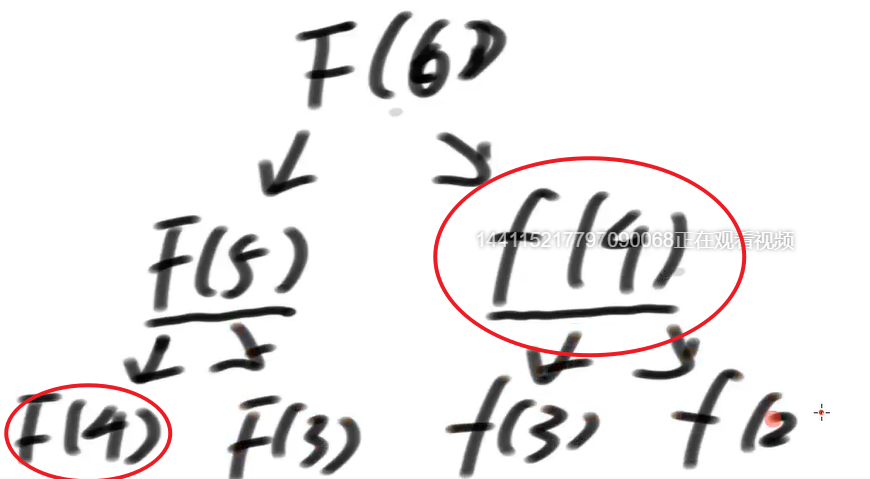
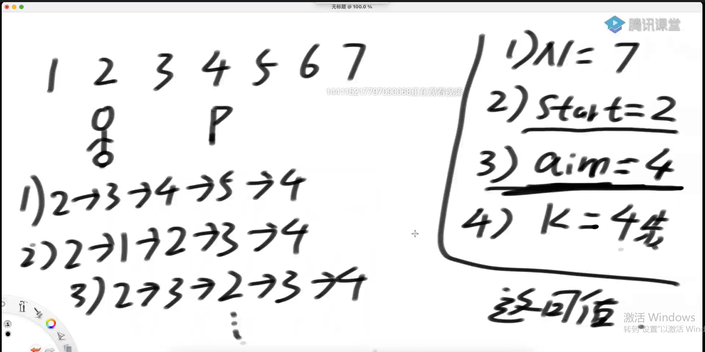
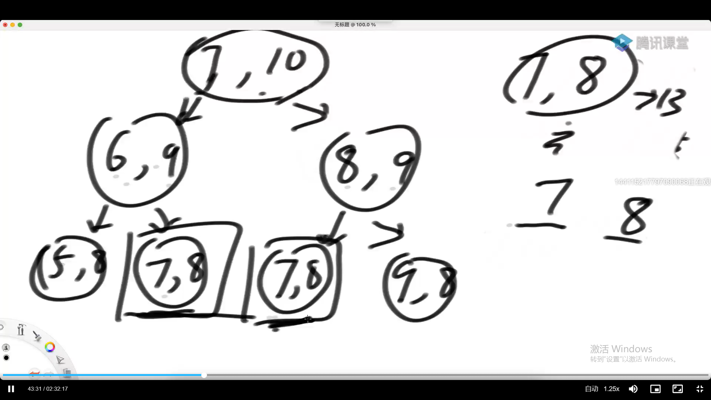

# 知识点

## 1动态规划

* **什么是动态规划？**举个例子，求斐波那契数列F（6）需要F（5）和F（4），F（5）又需要F（4），重复计算。所以可以构建一个缓存表，计算了一次F（4）后存着，下次就不用再计算了，这被称为动态规划（有点像cpu缓存）
* **动态规划能解决什么问题？**有重复的过程，结果，
* **从顶向下的位置依赖：**准备一张表，如果结果没算过，算，然后存到表了，算过了，找表就行了
* **怎么做动态转移**先写暴力解（尝试解），画缓存表，从basicBase开始写缓存表，手动写缓存表

* 局部函数需要对传入的参数做检验

* 认识二分法

  * 经常见到二分法是在有序的条件下，但有序是使用二分法的必要条件吗
  * 不是，精髓是能找到一种排他性的原则，一半有，另一半没有

* 二分点的求法

  * 一般使用$mid=\frac{L+R}{2}$, 这种求二分点有溢出的风险
  * L=20亿，R=19亿，mid应该是19.5亿，但是L+R会到39亿，溢出
  * 应该使用：$mid=L+\frac{R-L}{2}$, 写成mid = L+（R-L）>>2

* 经典写法，被火车撞了都不能忘

* Master公式：计算递归算法的时间复杂度

  形如T(N) = a * T(N/b) + O(N^d)(其中的a、b、d都是常数)的递归函数，可以直接通过Master公式来确定时间复杂度

  $T(N)=a*T(\frac{N}{b})+O(N^d)$, 其中，第一个加数是递归函数里面的递归的时间复杂度，第二个加数是非递归需要的时间复杂度，a，b，d都为常数

  * $log_ba<d ，那么时间复杂度T(N)= O(N^d)$
  * $log_ba>d ，那么时间复杂度T(N)= O(N^{log_ba})$
  * $log_ba==d ，那么时间复杂度T(N)= O(N^dlogN),(logN=log_2N,省略了2)$

* HashMap中，如果key是原生类型（Java自带，包括包装类），是值传递，检查的是值；如果是自己定义的类型，是地址传递（即使两个key的成员变量都相同，因为地址不同，也是不同的key），检查的是地址（8个字节的整型，因为64位机子内存地址是64位）

* HashMap能够做到增删改查O（1），但是常数项非常大

* 有序表，也就是TreeMap、TreeSet，是一个接口，实现类有红黑树、avl、sb数、跳表，能够做到增删改查都是O(logN)；TreeMap的key必须实现比较器

* 任何比较器的compare方法，返回负数的时候，认为第一个参数应该排在前面，返回正数的时候，认为第二个参数应该排在前面，返回0的时候，认为无所谓

* Arrary.sort方法如果传的是自定义的类型，还需要传进去一个比较器，因为系统不知道怎么比较，有序表也可传（a,b) -> a.id-b.id.

* Treemap不会覆盖之前的记录

* 重点不是排序的时候，就应该用比较器，而不需要自己去排序

* HashMap对以字符串为key的对象，不是O（1），是O（len（str））